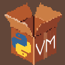

# PyVM - **Virtual Machine**

### PyVM is a registry-based virtual machine that runs a custom assembly-like language called **PVM**

# Specs
### Check the `spec.txt` file in the repo

# Contribute
### Feel free to fork it and do whatever you want with it 

# Licensing
GPL-v3